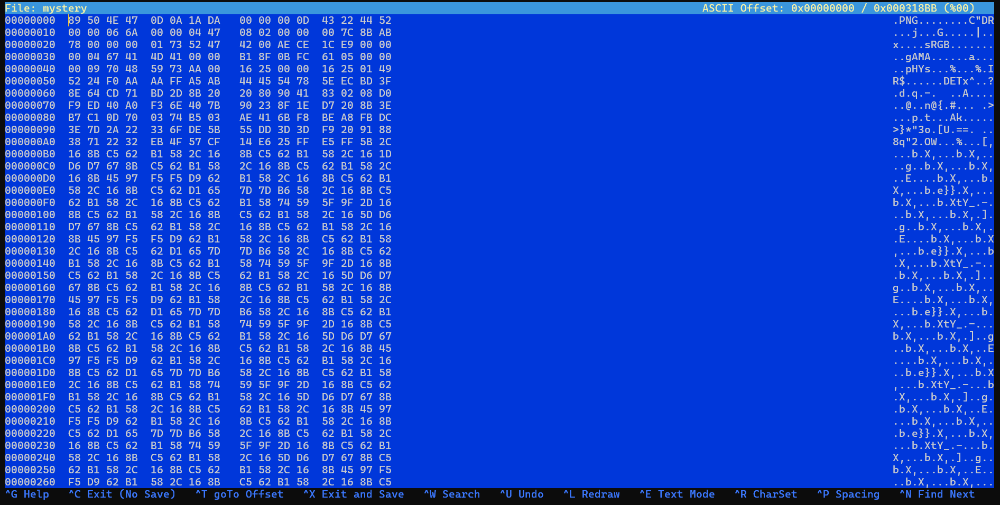
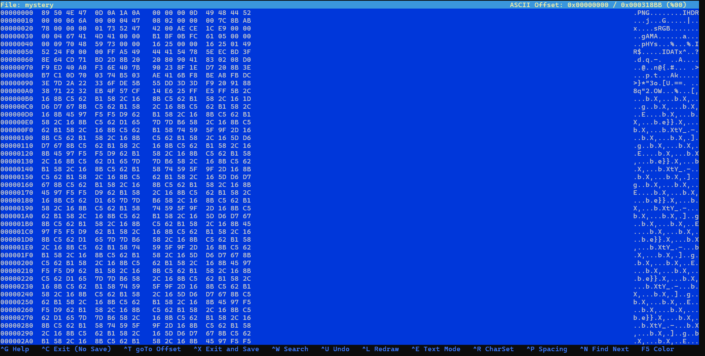

## Reto: c0rrupt
### Descripción
Encontramos esto [archivo](https://jupiter.challenges.picoctf.org/static/ab30fcb7d47364b4190a7d3d40edb551/mystery). Recuperar la bandera.
### Solución

Primero descargamos el archivo 
```shell
wget https://jupiter.challenges.picoctf.org/static/ab30fcb7d47364b4190a7d3d40edb551/mystery
```

Ahora en la pista nos dice que arreglemos el encabezado, así que checamos el encabezado con el siguiente comando:
```shell
xxd mystery | head
```

Salida:
```css
┌──(hackerjos㉿Joshue)-[/]
└─$ xxd mystery | head
00000000: 8965 4e34 0d0a b0aa 0000 000d 4322 4452  .eN4........C"DR
00000010: 0000 066a 0000 0447 0802 0000 007c 8bab  ...j...G.....|..
00000020: 7800 0000 0173 5247 4200 aece 1ce9 0000  x....sRGB.......
00000030: 0004 6741 4d41 0000 b18f 0bfc 6105 0000  ..gAMA......a...
00000040: 0009 7048 5973 aa00 1625 0000 1625 0149  ..pHYs...%...%.I
00000050: 5224 f0aa aaff a5ab 4445 5478 5eec bd3f  R$......DETx^..?
00000060: 8e64 cd71 bd2d 8b20 2080 9041 8302 08d0  .d.q.-.  ..A....
00000070: f9ed 40a0 f36e 407b 9023 8f1e d720 8b3e  ..@..n@{.#... .>
00000080: b7c1 0d70 0374 b503 ae41 6bf8 bea8 fbdc  ...p.t...Ak.....
00000090: 3e7d 2a22 336f de5b 55dd 3d3d f920 9188  >}*"3o.[U.==. ..
```

En la salida podemos ver que existen indicios de que es un png.

Recordemos que el formato especifico de la cabecera tiene una estructura determinada, así que usamos un editor hexadecimal para corregir.
```shell
hexeditor mystery
```

Y ponemos en la primera linea el siguiente formato de cabecera:
 

Vemos que al verificar sigue siendo data:
```css
file mystery
mystery: data
```

Al revisar los `chunk` en la salida anteriormente mostrada, podemos ver que están dañados también, así que vamos a corregirlos.
chunk IHDR`
```shell
49 48 44 52
```

Al ver el tipo de archivo, vemos que ya es reconocible, pero que aun no nos puede mostrar toda la imagen, asi que vamos a utilizar la siguiente herramienta:
```shell
sudo apt install pngcheck
```

Una vez instalada la herramienta checamos que hay de malo con nuestra imagen.
```shell
pngcheck -v mystery
```

Salida:
```q
┌──(hackerjos㉿Joshue)-[/]
└─$ pngcheck -v mystery
zlib warning:  different version (expected 1.2.13, using 1.3.1)

File: mystery (202940 bytes)
  chunk IHDR at offset 0x0000c, length 13
    1642 x 1095 image, 24-bit RGB, non-interlaced
  chunk sRGB at offset 0x00025, length 1
    rendering intent = perceptual
  chunk gAMA at offset 0x00032, length 4: 0.45455
  chunk pHYs at offset 0x00042, length 9: 2852132389x5669 pixels/meter
  CRC error in chunk pHYs (computed 38d82c82, expected 495224f0)
ERRORS DETECTED in mystery
```

Vemos que hay un error de redundancia cíclica en el `chunk PHYs.` Así que en el editor lo corregiremos, haciendo varias modificaciones, al final queda de la siguiente manera:


Al volver a verificar, vemos que ya no nos arroja errores:
```css
└─$ pngcheck -v mystery
zlib warning:  different version (expected 1.2.13, using 1.3.1)

File: mystery (202940 bytes)
  chunk IHDR at offset 0x0000c, length 13
    1642 x 1095 image, 24-bit RGB, non-interlaced
  chunk sRGB at offset 0x00025, length 1
    rendering intent = perceptual
  chunk gAMA at offset 0x00032, length 4: 0.45455
  chunk pHYs at offset 0x00042, length 9: 5669x5669 pixels/meter (144 dpi)
  chunk IDAT at offset 0x00057, length 65445
    zlib: deflated, 32K window, fast compression
  chunk IDAT at offset 0x10008, length 65524
  chunk IDAT at offset 0x20008, length 65524
  chunk IDAT at offset 0x30008, length 6304
  chunk IEND at offset 0x318b4, length 0
No errors detected in mystery (9 chunks, 96.3% compression).
```

Y al abrir el archivo obtenemos la bandera:
```flag
picoCTF{c0rrupt10n_1847995}
```

### Notas adicionales
### Referencias

 
