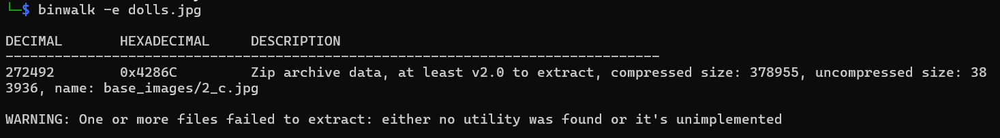
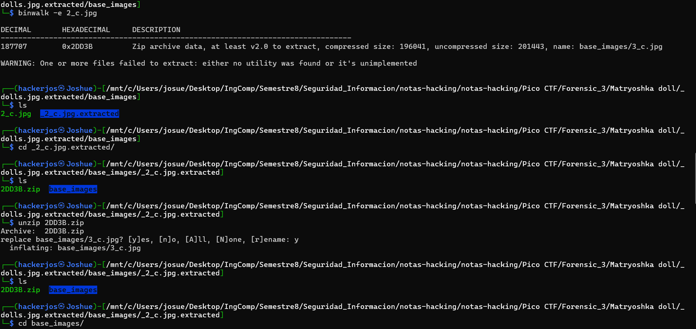
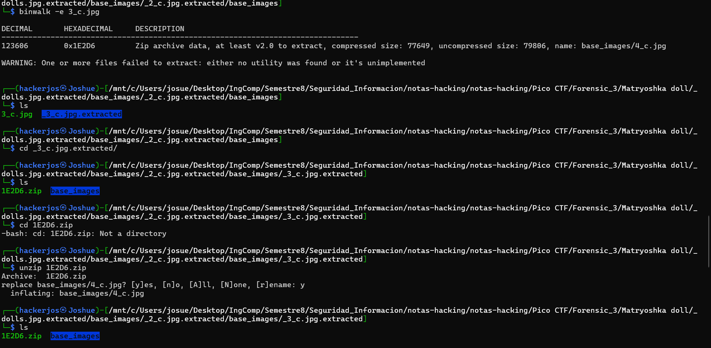
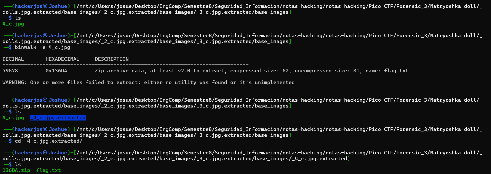

## Reto: Matryoshka doll
### Descripción
Las muñecas Matryoshka son un conjunto de muñecas de madera de tamaño decreciente colocadas una dentro de otra. ¿Cuál es el final? Imagen: [esto](https://mercury.picoctf.net/static/f6cc2560a70b1ea811c151accba5390f/dolls.jpg)

### Solución
Primero descargamos el archivo:
```shell
wget https://mercury.picoctf.net/static/f6cc2560a70b1ea811c151accba5390f/dolls.jpg
```

Analiza el archivo `dolls.jpg`, y si adentro encuentra archivos incrustados, sistemas de archivos, imágenes comprimidas, zips escondidos, etc., **extrae todo automáticamente** en una carpeta.
```shell
binwalk -e dolls.jpg
```

Salida:


Obtenemos este directorio en particular de la extracción:
```shell
ls
```

Obtenemos lo siguiente:
```shell
4286C.zip  base_images
```

Descomprimimos el archivo:
```shell
unzip 4286C.zip
```

Nos pregunta lo siguiente, nosotros pondremos `y`:
```shell
replace base_images/2_c.jpg? [y]es, [n]o, [A]ll, [N]one, [r]ename: y
```

Ahora abrimos la siguiente carpeta:
```shell
cd base_images
```

Mostramos los archivos:
```shell
ls
```

Y nos muestra lo siguiente:
```css
2_c.jpg
```

Volveremos a aplicar el mismo comando:
```shell
binwalk -e 2_c.jpg
```

Volveremos a repetir el mismo proceso, quedando de la siguiente manera:


Veremos que nos vuelve a dar un archivo y volvemos a repetir el proceso:





Vemos un archivo llamado `flag.txt` y ahi se aloja la bandera:
```shell
cat flag.txt
```

Y nos regresa la bandera:
```flag
picoCTF{ac0072c423ee13bfc0b166af72e25b61}
```


### Notas adicionales
Una **Matrioshka** (también conocida como muñeca rusa) es un conjunto de muñecas de madera que están **metidas una dentro de otra**.  
Cada muñeca más grande contiene dentro otra muñeca más pequeña, y así sucesivamente, hasta llegar a la última, que es la más chiquita.
El reto se llama así porque **el archivo que te dan está "anidado"** igual que las muñecas.
### Referencias

