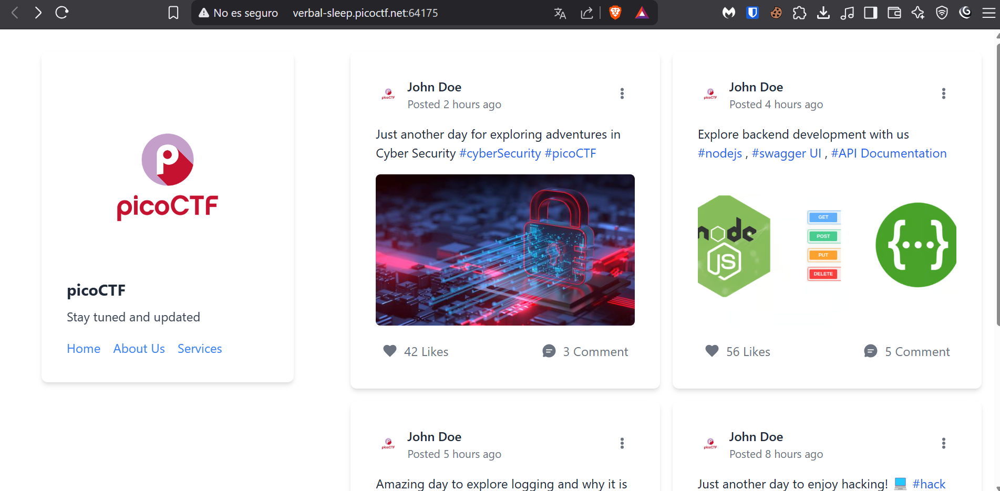
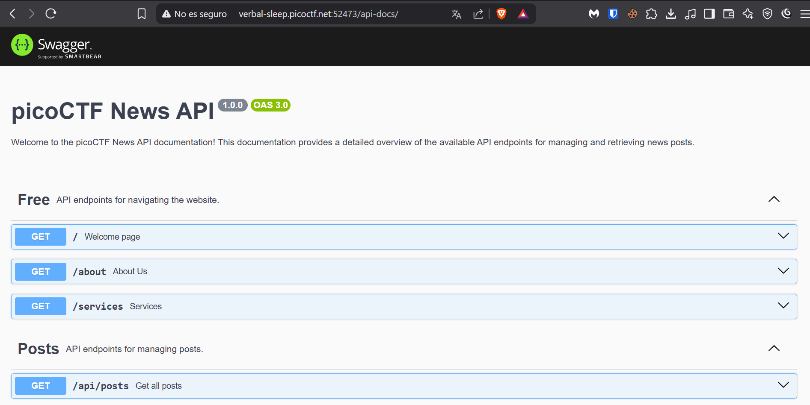
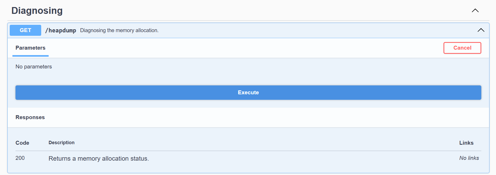
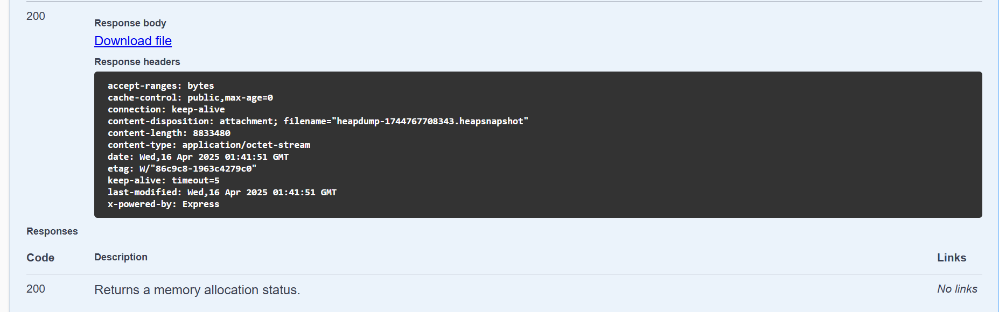

## Reto: head-dump
### Descripción
Welcome to the challenge! In this challenge, you will explore a web application and find an endpoint that exposes a file containing a hidden flag.The application is a simple blog website where you can read articles about various topics, including an article about API Documentation. Your goal is to explore the application and find the endpoint that generates files holding the server’s memory, where a secret flag is hidden.The website is running [picoCTF News](http://verbal-sleep.picoctf.net:64175/).

### Solución

Iniciamos dando clic sobre el sitio web de las noticias de picoCTF:



Como era el único hashtag al cual se le podía hacer clic y que fuera redirigido, es al de **API Documentation**, ingresamos y a continuación se nos mostrará la siguiente página:



Buscamos el apartado denominado _Diagnosing_ y la función **GET**, una vez desplegado, damos clic en "Execute":



Una vez que hacemos lo anterior, se nos muestra la opción de descargar el archivo, cosa que vamos a realizar.



Al descargar el archivo, procedemos a revisarlo con el bloc de notas, donde realizando una búsqueda con "picoCTF", encontramos la bandera que da solución al reto:

```flag
picoCTF{Pat!3nt_15_Th3_K3y_439bb394}
```
### Notas adicionales
### Referencias

 
